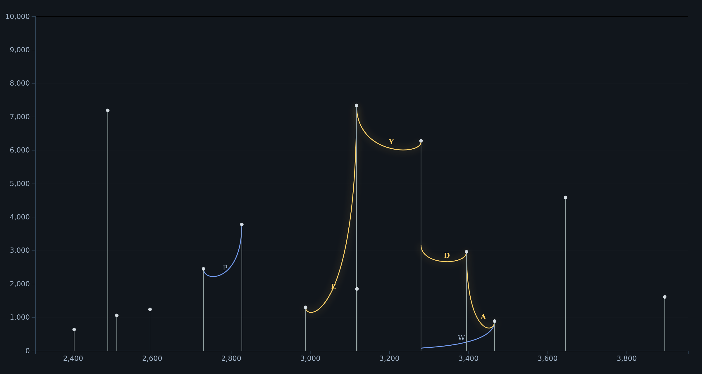

# Quick start

`cargo run --release -- --config config.yaml` to launch

## config.yaml examples

Read a deconvoluted spectrum and print peptides found:

```yaml
input:
  mzml_path: /path/to/scan.raw
  scan_index: 0

peptide_search: {}

print_peptides: {}
```

Read a spectrum, deconvolute it, build a graph and visualize it:

```yaml
input:
  mzml_path: /path/to/scan.raw
  scan_index: 0

deconvolution:
  method: greedy
  charge_range: [3, 4]
  tolerance:
    type: orbitrap
    value:
      calibration_mz: 200
      calibration_resolution: 120000

visualize_graph:
  output_html_path: /path/to/output/graph.html
```



Read a spectrum, search for peptides and align them to human V and J alleles from IMGT:

```yaml
input:
  mzml_path: /path/to/scan.raw
  scan_index: 0

peptide_search: {}

align_peptides:
  species: ["Homo sapiens"]

print_alignments: {}
```
